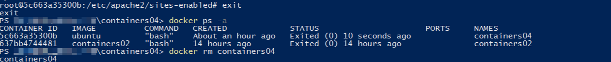

# Лабораторная работа: Использование контейнеров как среды выполнения

## Цель работы

Данная лабораторная работа призвана напомнить основные команды ОС Debian/Ubuntu. Также она позволит познакомиться с Docker и его основными командами.

## Задание

Запустить контейнер Ubuntu, установить Web-сервер Apache и вывести в браузере страницу с текстом "Hello, World!", объяснить назначение всех использованных команд.

## Описание выполнения работы с ответами на вопросы

*Весь код - "bash".

### Запуск и тестирование

1. Выполнил команду:

   `docker run -ti -p 8000:80 --name containers04 ubuntu bash` - Данная команда запускает новый контейнер с Ubuntu, переадресовывает порт 8000 хоста на 80-й порт контейнера и открывает интерактивный терминал.
    

2. В открывшемся окне выполнил следующие команды:

   `apt update` - Обновляет список пакетов в контейнере.
    

   `apt install apache2 -y` -  Устанавливает веб-сервер Apache.
    

    `service apache2 start` - Запускает Apache внутри контейнера.
    

3. В браузере открыл страницу [http://localhost:8000](http://localhost:8000), на которой отобразилась дефолтная страница Apache.
   

4. В терминале выполнил следующие команды:

   `ls -l /var/www/html/` - Отображает содержимое корневой папки /html веб-сервера.

   `echo '<h1>Hello, World!</h1>' > /var/www/html/index.html` - Переcоздаёт веб-страницу с текстом "Hello, World!".

5. Обновил страницу в браузере. Прописанный выше текст отобразился:
   

6. Далее посмотрел конфигурационный файл Apache. Для этого выполнил команды:

   `cd /etc/apache2/sites-enabled/`- Перешел в директорию с конфигурацией активных сайтов.

   `cat 000-default.conf`- Вывел содержимое конфигурационного файла.
    
7. Командой `exit` закрыл терминал и проверил список всех контейнеров, с помощью команды:

   `docker ps -a` -  Отображает все контейнеры, и активные, и остановленные.

8. После всего удалил контейнер командой:
   `docker rm containers04` - В консоль вывелось имя контейнера, что свидетельствует об успешном удалении контейнера.
   

## Выводы

В ходе лабораторной работы был освоен запуск контейнера с Ubuntu, установка и настройка веб-сервера Apache.
Также были изучены основные команды Docker для работы с контейнерами.
Результаты всех команд описаны, и подкреплены скриншотами.

## Библиография

`https://timeweb.cloud/tutorials/docker/komandy-docker-spisok?`
`https://chatgpt.com`
`https://moodle.usm.md/mod/hvp/view.php?id=282867`
